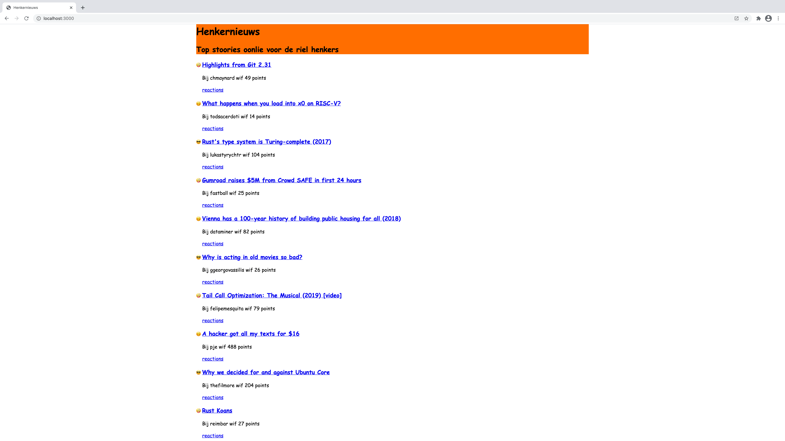

# Henkernieuws



 

[Live link](https://aqueous-beach-16784.herokuapp.com/)

Henkernieuws hes de best nieuws voor riel henkers lijk joe en mie.

Ritten in go en javascript, lijk ee pro.

## Table of contents

- [Getting started](#getting-started)
  - [Installing the project](#installing-the-project)
  - [Available commands](#available-commands)
- [Features](#features)
- [Tooling implementation](#tooling-implementation)
  - [Server](#server)
  - [Static site generation](#static-site-generation)
- [Packages used](#packages-used)
  - [Go](#go)
  - [Web](#web)

## Getting started

This program is built with Go@^1.16. This means that you have to install one of the Go 1.16 versions via the [golang website](https://golang.org). Also make sure you have [NodeJS](https://nodejs.org) installed with [Yarn v1](http://classic.yarnpkg.com) or (non-preferably) the [NPM package mananger](https://npmjs.com).

### Installing the project

```sh
$ git clone https://github.com/theonejonahgold/progressive-web-apps-2021.git pwa
$ cd pwa
$ go get && yarn # or "npm i"
$ go build -o pwa main.go
```

With this sequence of commands, you create a binary called `pwa` in the project root. While working on Henkernieuws, you use this binary to interact with your dev environment. **Do not use NPM scripts. They do not work**. If you want the NPM scripts to run, run `go install` first.

### Available commands

```sh
$ ./pwa start      # Serves the contents of the dist folder, only useful if you've already prerendered the site.
$ ./pwa build      # Downloads all henkernieuws data, and prerenders the entire site, also running snowpack to build everything.
$ ./pwa build-cron # Schedules the build command to run every full hour.
$ ./pwa dev        # Runs a server dynamically serving handlebars templates.
```

## Features

- [x] Static file serving
- [x] Prerendering as build step
- [x] Separate dynamic dev server
- [x] Best HackerNews clone to ever exist
- [X] Caching with service workers
- [X] Periodic rerendering on production
  - [ ] Updating service worker caches automatically

## API used

I am using the [HackerNews API][hn], which has very good documentation on how to use it. It is, however, quite cumbersome to use, as all children of a data object are referenced by ID only, and are not auto-populated. This means that you have to recursively populate children to get all comments for a story (which is what I've done with `PopulateComments`).

The API has no rate limit (for now), and can be used with [Firebase Client Libraries][fb-libraries]

## Tooling implementation

I am using [Go][golang] as my main programming language for tooling. It is a very simple but versatile language, primarily designed to create microservices for large cloud infrastructures (like Google's). It's also __extremely__ fast, has a gradual learning curve due to its simplicity and really good built-in documentation tools. The standard library is expansive, making it easy to just start programming things.

I built my application to do 4 things:

- **Prerender** the website with data provided by the [HackerNews Top Stories API endpoint][hn-top], rendering all pages to static HTML. Also processing the `src` and `public` folder contents with [Snowpack][snowpack] for use on the web.
- **Serve** the prerendered website on an http file server.
- **SSR** the website for development, including [Snowpack][snowpack] functionality.
- **Schedule** the prerender task periodically, updating the pages.

I'm going to talk a little bit about two of these implementations below.

### Server

Inside the `server` folder are two subfolders: `ssr` and `static`. These two subfolders hold different http request handlers for two different situations. `server.Run` takes one of these handlers, and spins up an http server passing requests to the given handler. This means that I can create an infinite amount of different http handlers for certain situations, and just plug them into the server.

### Static site generation

The static site generation happens in `prerender/prerender.go`. You can see that the `Build` func goes through a lot of steps:

1. Clearing the dist folder
2. Preparing the API data for rendering
  1. Fetching the [HackerNews top stories][hn-top]
  2. Populating the comments recursively (the api only gives you IDs to work with, not the actual comment content...)
  3. Saving the result to disk for debugging purposes
3. Rendering the homepage
4. Rendering the story pages
5. Rendering the offline pages
6. Running the Snowpack production build command

## Packages used

### Go

- [aymerick/raymond](https://github.com/aymerick/raymond)
- [robfig/cron/v3](https://github.com/robfig/cron)

### Web

- [Snowpack][snowpack]
- [TypeScript][ts]
- [ESLint][eslint]
- [Prettier][prettier]

## Sources

- [Golang website][golang]
- [This GitHub issue to create a robust Go net/http server](https://github.com/golang/go/issues/13998)
- [This GitHub issue describing ways to add the right typing to `self` in a ServiceWorker scope](https://github.com/Microsoft/TypeScript/issues/11781#issuecomment-785350836)
- Declan Rek from [Voorhoede][voorhoede] and Joost Faber and Wouter van der Heijde from [CMDA Minor Web][minor]

[golang]: https://golang.org
[hn]: https://github.com/HackerNews/API
[fb-libraries]: https://firebase.google.com/docs/libraries/
[hn-top]: https://github.com/HackerNews/API#new-top-and-best-stories
[snowpack]: https://snowpack.dev
[ts]: https://www.typescriptlang.org
[eslint]: https://eslint.org
[prettier]: https://prettier.io
[voorhoede]: https://voorhoede.nl
[minor]: https://github.com/cmda-minor-web